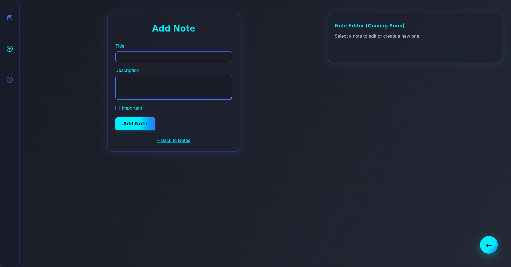

# Luminote

A modern, glassmorphism-inspired note-taking web application built with FastAPI, MongoDB, Bootstrap, and Jinja2 templates. Luminote features a premium, creative UI, secure backend, and seamless user experience for managing notes.

---

## Features
- Ultra-modern, glassmorphism UI with neon highlights
- Add, view, update, and delete notes
- Mark notes as important
- MongoDB backend for scalable data storage
- FastAPI for high-performance APIs
- Bootstrap for modern, mobile-friendly layouts
- Minimal, icon-only sidebar navigation
- Animated transitions and beautiful modals

## Tech Stack
- Python (FastAPI)
- MongoDB
- Bootstrap 5
- Jinja2 Templates

## Prerequisites
- Python 3.8+
- [pip](https://pip.pypa.io/en/stable/)
- [MongoDB](https://www.mongodb.com/try/download/community) (running locally on default port 27017)

## Setup

1. **Clone the repository**
   ```bash
   git clone https://github.com/Aizyy008/notebook_fastAPI.git
   cd fast_api_notebook
   ```

2. **Create a virtual environment**
   ```bash
   python3 -m venv env
   source env/bin/activate
   ```

3. **Install dependencies**
   ```bash
   pip install fastapi jinja2 uvicorn pymongo
   ```

4. **Start MongoDB**
   Ensure MongoDB is running locally. On Linux:
   ```bash
   sudo systemctl start mongod
   ```
   Or use MongoDB Compass to manage your database.

## Running the Project

Start the FastAPI server with Uvicorn:

```bash
uvicorn index:app --reload
```

- Open your browser and go to: [http://127.0.0.1:8000/](http://127.0.0.1:8000/)

## Navigation & Main Routes
- `/` - Main landing page (Luminote intro)
- `/notes` - View all notes (vertical list, all attributes shown)
- `/add-note/` - Add a new note (form)
- `/update-note/{note_id}` - Update a note (form)
- `/about` - About page (project info & developer CV)

## Project Structure
- `index.py` - Main FastAPI application (entry point)
- `routes/` - FastAPI routers (note routes)
- `models/` - Data models
- `schemas/` - Data schemas/serializers
- `templates/` - Jinja2 HTML templates (UI pages)
- `static/` - Static files (CSS, JS, images)
- `env/` - Python virtual environment (should not be committed)

## Design & Screenshots

> **Place your screenshots in `static/screenshots/` and use the following markdown to display them.**

### Main Page


### Notes Page


### Add Note Page


### Update Note Page


### Delete Note Confirmation


### About Page


---

**Created by Aizan Ahmed** 